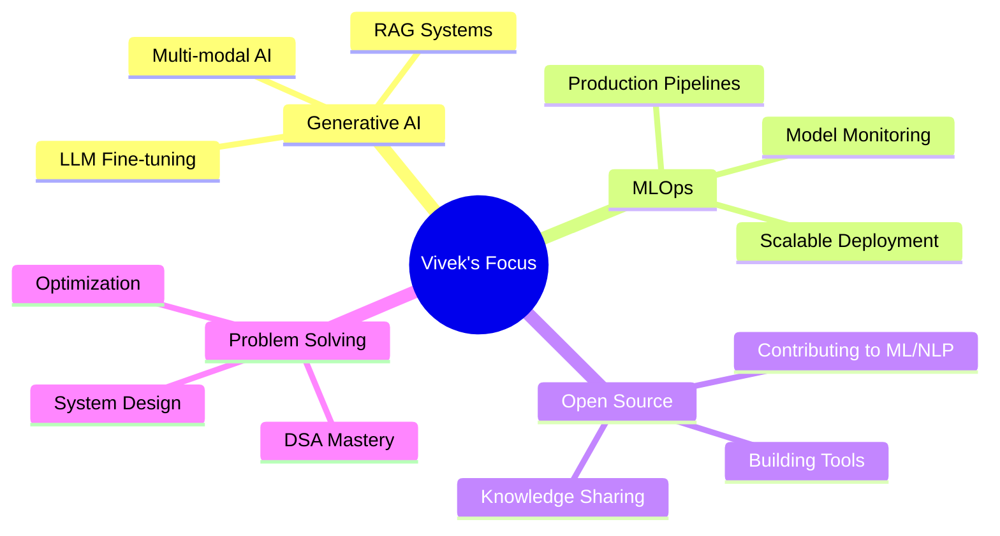

<div align="center">

# 👋 Hi, I'm Vivek Marri

### AI/ML Engineer | Generative AI Specialist | MLOps Enthusiast

[](https://git.io/typing-svg)

[](https://www.linkedin.com/in/vivek-marri-49419a274/)
[](mailto:vivekyadavmarri@gmail.com)
[](https://github.com/VIVEK-MARRI)

</div>

---

## 🚀 About Me

```python
class VivekMarri:
    def __init__(self):
        self.role = "AI/ML Engineer"
        self.focus_areas = ["MLOps", "Generative AI", "Deep Learning", "NLP"]
        self.current_work = [
            "Building end-to-end AI applications",
            "Production-grade ML pipelines", 
            "Real-time prediction systems"
        ]
        self.passion = "Transforming complex problems into elegant AI solutions"
    
    def get_expertise(self):
        return {
            "Machine Learning": ["PyTorch", "TensorFlow", "Scikit-learn", "XGBoost"],
            "Generative AI": ["LangChain", "Hugging Face", "Gemini API", "RAG"],
            "MLOps": ["MLflow", "Airflow", "Docker", "GitHub Actions"],
            "Backend": ["FastAPI", "Flask", "Streamlit"],
            "Databases": ["PostgreSQL", "MongoDB", "MySQL"],
            "Cloud & DevOps": ["AWS", "Docker", "CI/CD", "Prometheus", "Grafana"]
        }
``` 

<div align="center">

### 🎯 Core Competencies

</div>

<table align="center">
<tr>
<td align="center" width="50%">

**🤖 AI & Machine Learning**
- Deep Learning (CNNs, RNNs, Transformers)
- NLP & Language Models
- Computer Vision
- Predictive Analytics

</td>
<td align="center" width="50%">

**⚙️ MLOps & Engineering**
- End-to-End ML Pipelines
- Model Deployment & Monitoring
- Microservices Architecture
- Real-time Systems

</td>
</tr>
</table>

---

## 💼 Featured Projects

<details open>
<summary><b>🌊 Urban Flood Early Warning System</b> - Production ML Platform</summary>
<br>

**Enterprise-grade real-time flood risk prediction system for urban disaster management**

- 🏗️ **Architecture**: Multi-service stack with Airflow orchestration, MLflow tracking, FastAPI microservices, Streamlit dashboards
- 📊 **Tech Stack**: Python, PostgreSQL, Prometheus, Grafana, Docker
- ⚡ **Features**: 
  - Automated ML pipelines with live model retraining
  - Real-time alerting and actionable insights
  - Production monitoring and observability
  - One-command containerized deployment for city-scale usage

**Impact**: Ready for production deployment in urban planning departments

</details>

<details>
<summary><b>🚚 IntelliLog-AI</b> - Intelligent Logistics Optimization</summary>
<br>

**Real-time optimization platform for urban delivery fleet management**

- 🎯 **Core ML**: XGBoost-based ETA prediction with high accuracy
- 🗺️ **Optimization**: Google OR-Tools for Vehicle Routing Problem (VRP)
- 🔧 **Backend**: High-throughput FastAPI microservices
- 📦 **Deployment**: Fully containerized with Docker
- 📈 **Results**: ~25% reduction in delivery delays through custom routing heuristics

**Impact**: Scalable solution for logistics companies optimizing last-mile delivery

</details>

<details>
<summary><b>🌱 EcoPackAI</b> - Sustainable Packaging Recommender</summary>
<br>

**AI-powered system for sustainable and cost-effective packaging material recommendations**

- 🧠 **ML Features**: Product attributes analysis, environmental metrics optimization
- 💚 **Focus Areas**: CO₂ impact, recyclability, mechanical strength, cost efficiency
- 🛠️ **Stack**: Python, PostgreSQL, SQLAlchemy, FastAPI/Flask
- 📊 **Capabilities**: 
  - Machine learning-based recommendations
  - RESTful API for integration
  - Interactive dashboards
  - Real-world dataset integration

**Impact**: Helping businesses make environmentally conscious packaging decisions

</details>

<details>
<summary><b>🔐 RiskLens AI</b> - Fraud Detection System</summary>
<br>

**Advanced fraud detection for credit card transactions with explainable AI**

- 🤖 **Model**: Random Forest with optimized hyperparameters
- 🔍 **Explainability**: SHAP integration for transparent decision-making
- 🌐 **Interface**: Flask API + Streamlit dashboard
- 📊 **Features**: Real-time scoring, risk visualization, interpretable predictions

**Impact**: Production-ready fraud prevention with trustworthy AI explanations

</details>

<details>
<summary><b>🏥 AI HealthCare Chatbot</b> - Medical Query Assistant</summary>
<br>

**Intelligent conversational AI for healthcare information**

- 💬 **NLP Engine**: Advanced natural language understanding
- 🔧 **Framework**: Flask-based REST API
- 🎯 **Purpose**: Medical query assistance and information retrieval
- ⚕️ **Domain**: Healthcare-specific knowledge base

</details>

<details>
<summary><b>🌐 Language Detection System</b> - BERT-based NLP</summary>
<br>

**Multi-language detection and classification using transformer models**

- 🧠 **Model**: Fine-tuned BERT architecture
- 🔤 **Capabilities**: Multi-language support with high accuracy
- 📚 **Use Cases**: Content classification, language routing, text analysis

</details>

<details>
<summary><b>💡 INSIGHT_BOT</b> - Generative AI Assistant</summary>
<br>

**Next-generation AI assistant powered by cutting-edge GenAI**

- 🚀 **Framework**: LangChain for advanced orchestration
- 🤖 **LLM**: Google Gemini API integration
- 🎨 **Interface**: Interactive Streamlit web application
- ⚡ **Features**: Contextual conversations, multi-turn dialogue, intelligent responses

</details>

<details>
<summary><b>📊 DSA Mastery Repository</b> - Algorithm Practice</summary>
<br>

**Daily problem-solving and algorithm implementation**

- 📚 **Coverage**: Arrays, Graphs, Trees, Dynamic Programming, Greedy Algorithms
- 💪 **Practice**: Consistent problem-solving to maintain sharp coding skills
- 🎯 **Goal**: Master data structures and algorithmic thinking

</details>

---

## 🛠️ Technology Stack

<div align="center">

### Languages


### AI/ML Frameworks


### Generative AI & NLP


### MLOps & DevOps


### Backend & APIs


### Databases


### Cloud & Tools


</div>

---

## 📊 GitHub Analytics

<div align="center">
  


</div>

---

## 🎯 Current Focus

<div align="center">



</div>

- 🚀 Building production-grade **Generative AI applications** (text, image, multi-modal)
- 🏗️ Designing **scalable MLOps pipelines** for enterprise deployment
- 🤝 Contributing to **open-source ML/NLP projects**
- 💡 Creating **AI-powered solutions** for real-world problems
- 📚 Continuous learning: **Advanced LLMs, System Design, Cloud Architecture**

---

## 🏆 Achievements & Highlights

- ✅ Built **end-to-end ML systems** from research to production
- ✅ Achieved **~25% efficiency improvement** in logistics optimization
- ✅ Implemented **production-grade MLOps** infrastructure with monitoring
- ✅ Developed **explainable AI systems** for critical applications
- ✅ Consistent **problem-solving practice** for algorithmic excellence

---

## 🐍 Contribution Activity

<div align="center">

<picture>
  <source media="(prefers-color-scheme: dark)" srcset="https://raw.githubusercontent.com/VIVEK-MARRI/VIVEK-MARRI/output/github-contribution-grid-snake-dark.svg">
  <source media="(prefers-color-scheme: light)" srcset="https://raw.githubusercontent.com/VIVEK-MARRI/VIVEK-MARRI/output/github-contribution-grid-snake.svg">
  
</picture>

</div>

---

## 💬 Let's Connect

<div align="center">

I'm always interested in collaborating on innovative AI projects, discussing ML research, or exploring new opportunities!

[](https://www.linkedin.com/in/vivek-marri-49419a274/)
[](mailto:vivekyadavmarri@gmail.com)
[](https://github.com/VIVEK-MARRI)

---


### ⭐ "AI won't replace humans, but humans with AI will replace humans without it." ⭐

</div>
