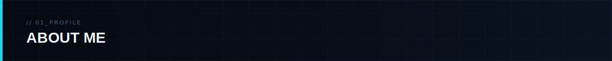
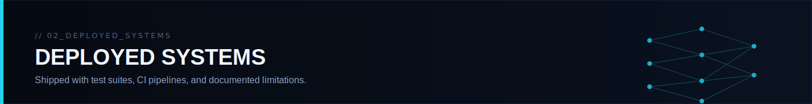
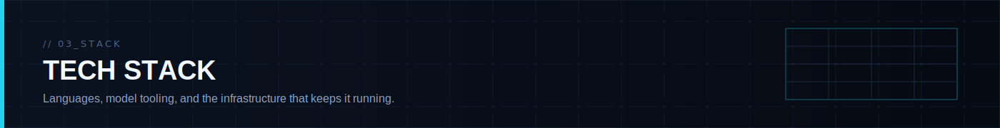
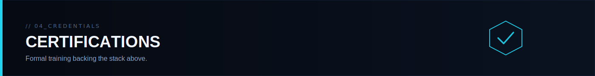
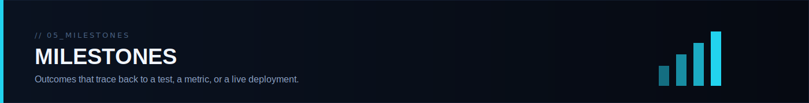
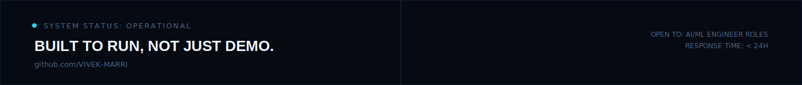

  

  

  
  
  
  

 

  

I'm a B.Tech CSE graduate from JNTUH University College of Engineering, Manthani, currently looking for AI/ML Engineer and Data Science roles. I build multi-agent and retrieval systems the way I'd build any production backend — with real test suites, CI enforcement, and an honest limitations section, not just a notebook that worked once.

  

### Core Competencies

<table>
<tr>
<td align="center" width="33%">

**Agentic AI**

Multi-Agent Orchestration (LangGraph)
 Tool-Calling &amp; Task Planning
 Agent Guardrails &amp; Hallucination Checks
 Citation-Verified Generation

</td>
<td align="center" width="33%">

**Retrieval &amp; RAG**

Hybrid Search (BM25 + Dense)
 Cross-Encoder Reranking
 Vector Databases (pgvector)
 Reciprocal Rank Fusion

</td>
<td align="center" width="33%">

**MLOps &amp; Engineering**

End-to-End ML Pipelines
 CI/CD &amp; Coverage Enforcement
 Real-Time Systems (Redis, WebSocket)
 Model Deployment &amp; Monitoring

</td>
</tr>
</table>

 

  

<table>
<tr>
<td width="50%" valign="top">

### [RegIntel AI](https://github.com/VIVEK-MARRI/RegIntel-AI)
**Multi-agent regulatory intelligence for RBI/SEBI compliance**

| | |
|---|---|
| Retrieval | BM25 + pgvector HNSW, fused via RRF (k=60), BGE reranked |
| Agents | LangGraph — TaskPlanner, AgentExecutionEngine, AgentMessageBus |
| Trust layer | Citation verification + hallucination guard |
| Security | HS256 JWT, 6 RBAC roles, 34 permissions, SHA-256 audit log |
| Testing | 2,850+ backend tests, 80% coverage, 11-job CI pipeline |

`Python` `FastAPI` `React` `PostgreSQL/pgvector` `LangGraph` `Docker`

</td>
<td width="50%" valign="top">

### [IntelliLog AI](https://github.com/VIVEK-MARRI/IntelliLog-AI)
**Predictive logistics intelligence for fleet operations**

| | |
|---|---|
| Prediction | XGBoost delay model with SHAP explainability |
| Optimization | Google OR-Tools vehicle routing |
| Agents | 10-node LangGraph decision graph, separate worker process |
| Real-time | Redis Streams GPS → WebSocket → live fleet map |
| Observability | Docker Compose, Prometheus, Grafana |

`Python` `FastAPI` `React/TypeScript` `XGBoost` `LangGraph` `Redis`

</td>
</tr>
</table>

### Also Shipped

| Project | Description | Stack |
|---|---|---|
| [SHL Assessment Recommendation Agent](https://github.com/VIVEK-MARRI/SHL-assessment-recommendation-agent) | Deterministic RAG agent for SHL test recommendations. Live on Railway, 375 passing tests. | FastAPI, Docker |
| [OrgPulse AI](https://github.com/VIVEK-MARRI/OrgPulse-AI) | Meeting transcripts → executive summaries and org risk signals. | React, Gemini, Neo4j |
| [CRM AI Agent](https://github.com/VIVEK-MARRI/CRM_Ai_Agent) | Automated lead scoring and analytics. | React, Flask, FastAPI |
| [EPMSSTS](https://github.com/VIVEK-MARRI/EPMSSTS) | Emotion-preserving speech translation — Telugu, Hindi, English. | FastAPI, faster-whisper |
| [Urban Flood Early Warning](https://github.com/VIVEK-MARRI/urban_flood_early_warning) | Airflow-orchestrated flood risk MLOps pipeline. | Airflow, XGBoost |
| [EcoPack AI](https://github.com/VIVEK-MARRI/ECO_PACK_AI) | Packaging material recommender weighing cost, CO2, recyclability. | Flask, SQLAlchemy |
| [RiskLens AI](https://github.com/VIVEK-MARRI/risklens-api) | Explainable fraud-scoring API — Random Forest + SHAP. | Flask, Streamlit |
| [Insight Bot](https://github.com/VIVEK-MARRI/INSIGHT_BOT) | GenAI assistant for QA over PDFs, websites, images, audio. | LangChain, Gemini API |

*Earlier builds: [AI Healthcare Chatbot](https://github.com/VIVEK-MARRI/AI-health-care-chat-bot), [Language Detection (BERT)](https://github.com/VIVEK-MARRI/Language-Detection-Using-NLP), [DSA Practice Log](https://github.com/VIVEK-MARRI/DSA)*

 

  

**Languages**
 

**Agentic AI &amp; Retrieval**
 

**Backend &amp; Data**
 

**MLOps &amp; Infra**
 

 

  

 

  

- Built a multi-agent RAG platform (**RegIntel AI**) with 2,850+ passing tests and an 11-job CI pipeline
- Shipped a deterministic RAG recommendation agent (**SHL Assessment Agent**) with 375 passing tests, live on Railway
- Designed real-time systems combining LangGraph agents, Redis Streams, and live WebSocket dashboards (**IntelliLog AI**)
- Earned Oracle (Generative AI, Agentic AI) and NVIDIA (Generative AI) professional certifications

 

## GitHub Analytics

  

---

## Contribution Activity

<picture>
  <source media="(prefers-color-scheme: dark)" srcset="https://raw.githubusercontent.com/VIVEK-MARRI/VIVEK-MARRI/output/github-contribution-grid-snake-dark.svg">
  <source media="(prefers-color-scheme: light)" srcset="https://raw.githubusercontent.com/VIVEK-MARRI/VIVEK-MARRI/output/github-contribution-grid-snake.svg">
  
</picture>

 

  

