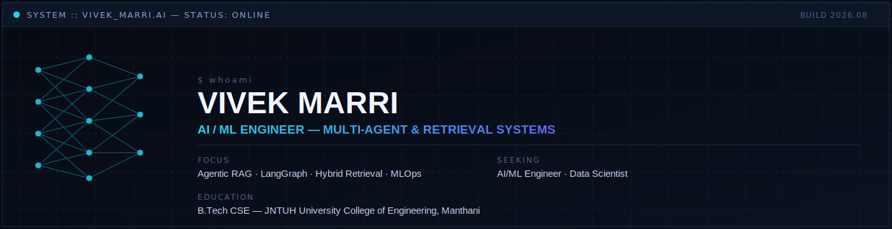

  

  

  
  
  
  

---

## Overview

I’m a B.Tech CSE graduate focused on AI/ML Engineer and Data Scientist roles. I build multi-agent and retrieval systems with production standards: tests, CI/CD, metrics, and clear limitations. My work emphasizes reliable deployment, measurable outcomes, and architecture that can be verified quickly through code, workflows, and test evidence.

| | |
|---|---|
| **Focus** | Multi-Agent Systems · Retrieval & RAG · MLOps · Applied NLP |
| **Seeking** | AI/ML Engineer · Data Scientist |
| **Standard** | If it isn't backed by a test, a metric, or a commit, it doesn't go on this page. |

---

  

<table>
<tr>
<td width="50%" valign="top">

### [RegIntel AI](https://github.com/VIVEK-MARRI/RegIntel-AI)
**Delivers grounded RBI/SEBI compliance answers with citation verification and a hallucination guard.**

| | |
|---|---|
| Retrieval | BM25 + pgvector HNSW, fused via RRF (k=60), BGE reranked |
| Agents | LangGraph — TaskPlanner, AgentExecutionEngine, AgentMessageBus |
| Trust layer | Citation verification + hallucination guard |
| Security | HS256 JWT, 6 RBAC roles, 34 permissions, SHA-256 audit log |
| Testing | 2,850+ backend tests, 80% coverage, 11-job CI pipeline |

`Python` `FastAPI` `React` `PostgreSQL/pgvector` `LangGraph` `Docker`

</td>
<td width="50%" valign="top">

### [IntelliLog AI](https://github.com/VIVEK-MARRI/IntelliLog-AI)
**Cuts fleet delays with predictive ETA modeling and route optimization in real time.**

| | |
|---|---|
| Prediction | XGBoost delay model with SHAP explainability |
| Optimization | Google OR-Tools vehicle routing |
| Agents | 10-node LangGraph decision graph, separate worker process |
| Real-time | Redis Streams GPS → WebSocket → live fleet map |
| Observability | Docker Compose, Prometheus, Grafana |

`Python` `FastAPI` `React/TypeScript` `XGBoost` `LangGraph` `Redis`

</td>
</tr>
</table>

## Proof of Work

**RegIntel AI**
- [CI workflow (.github/workflows/ci.yml)](https://github.com/VIVEK-MARRI/RegIntel-AI/blob/main/.github/workflows/ci.yml)
- [Benchmark workflow (.github/workflows/benchmark.yml)](https://github.com/VIVEK-MARRI/RegIntel-AI/blob/main/.github/workflows/benchmark.yml)
- [Test suite (tests/)](https://github.com/VIVEK-MARRI/RegIntel-AI/tree/main/tests)
- [Architecture doc (docs/architecture/01-system-architecture.md)](https://github.com/VIVEK-MARRI/RegIntel-AI/blob/main/docs/architecture/01-system-architecture.md)

**IntelliLog AI**
- [CI workflow (.github/workflows/ci.yml)](https://github.com/VIVEK-MARRI/IntelliLog-AI/blob/main/.github/workflows/ci.yml)
- [Test workflow (.github/workflows/test.yml)](https://github.com/VIVEK-MARRI/IntelliLog-AI/blob/main/.github/workflows/test.yml)
- [LangGraph agent module (src/agent/)](https://github.com/VIVEK-MARRI/IntelliLog-AI/tree/main/src/agent)
- [Test suite (tests/)](https://github.com/VIVEK-MARRI/IntelliLog-AI/tree/main/tests)

### Also Shipped

| Project | Description | Stack |
|---|---|---|
| [SHL Assessment Recommendation Agent](https://github.com/VIVEK-MARRI/SHL-assessment-recommendation-agent) | Recommends role-fit SHL assessments with deterministic retrieval and production API delivery. | FastAPI, Docker |
| [OrgPulse AI](https://github.com/VIVEK-MARRI/OrgPulse-AI) | Converts meeting transcripts into executive summaries and organization risk insights. | React, Gemini, Neo4j |
| [CRM AI Agent](https://github.com/VIVEK-MARRI/CRM_Ai_Agent) | Automates lead scoring and analytics for faster sales prioritization. | React, Flask, FastAPI |
| [EPMSSTS](https://github.com/VIVEK-MARRI/EPMSSTS) | Preserves emotion while translating speech across Telugu, Hindi, and English. | FastAPI, faster-whisper |
| [Urban Flood Early Warning](https://github.com/VIVEK-MARRI/urban_flood_early_warning) | Predicts flood risk with scheduled MLOps pipelines for early warning workflows. | Airflow, XGBoost |
| [RiskLens AI](https://github.com/VIVEK-MARRI/risklens-api) | Scores card transactions for fraud with interpretable model outputs. | Flask, Streamlit |

*Earlier builds: [AI Healthcare Chatbot](https://github.com/VIVEK-MARRI/AI-health-care-chat-bot), [Language Detection (BERT)](https://github.com/VIVEK-MARRI/Language-Detection-Using-NLP), [DSA Practice Log](https://github.com/VIVEK-MARRI/DSA)*

---

  

**Languages** &nbsp;   

**Agents & Retrieval** &nbsp;   

**Backend** &nbsp;    

**MLOps** &nbsp;    

---

  

---

## Metrics

  
  

  

---

  

<b>Plain-text summary</b>

Vivek Marri
Role: AI/ML Engineer focused on multi-agent systems, retrieval, and MLOps
Education: B.Tech CSE, JNTUH University College of Engineering, Manthani

Certifications:
Oracle Generative AI Professional
Oracle Agentic AI Professional
NVIDIA Generative AI

Projects:
RegIntel AI
One-line: Multi-agent regulatory intelligence system for RBI/SEBI compliance with grounded, citation-backed answers.
Tech stack: Python, FastAPI, React, PostgreSQL, pgvector, LangGraph, Docker

IntelliLog AI
One-line: Predictive logistics platform for fleet delay forecasting, route optimization, and live operations visibility.
Tech stack: Python, FastAPI, React, TypeScript, XGBoost, LangGraph, Redis, OR-Tools, Prometheus, Grafana

SHL Assessment Recommendation Agent
One-line: Deterministic RAG service that recommends SHL assessments and exposes a production API.
Tech stack: FastAPI, Docker

OrgPulse AI
One-line: Transforms meeting transcripts into executive summaries and organizational risk signals.
Tech stack: React, Gemini, Neo4j

CRM AI Agent
One-line: Automates lead scoring and sales analytics workflows.
Tech stack: React, Flask, FastAPI

EPMSSTS
One-line: Emotion-preserving multilingual speech translation across Telugu, Hindi, and English.
Tech stack: FastAPI, faster-whisper

Urban Flood Early Warning
One-line: Flood-risk prediction pipeline with orchestration for early warning operations.
Tech stack: Airflow, XGBoost

RiskLens AI
One-line: Fraud detection API with interpretable model outputs for transaction risk scoring.
Tech stack: Flask, Streamlit

AI Healthcare Chatbot
One-line: Conversational assistant for healthcare information support.
Tech stack: Python, Flask, NLP

Language Detection Using NLP
One-line: BERT-based system for multilingual language identification.
Tech stack: Python, BERT, NLP

DSA Practice Log
One-line: Repository of algorithm and data structure practice solutions.
Tech stack: C++, Java, Python

